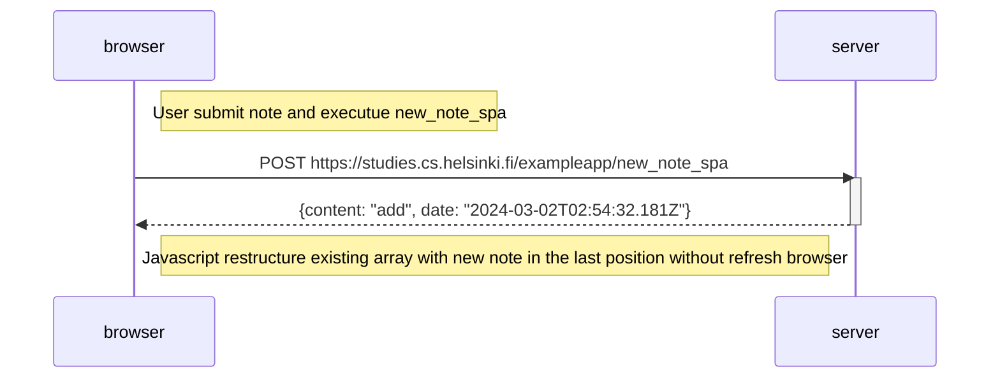

```mermaid
  sequenceDiagram
    participant browser
    participant server

    Note right of browser: User submit note and executue new_note_spa

    browser->>server: POST https://studies.cs.helsinki.fi/exampleapp/new_note_spa
    activate server
    server-->>browser: {content: "add", date: "2024-03-02T02:54:32.181Z"}
    deactivate server

    Note right of browser: Javascript restructure existing array with new note in the last position without refresh browser
```